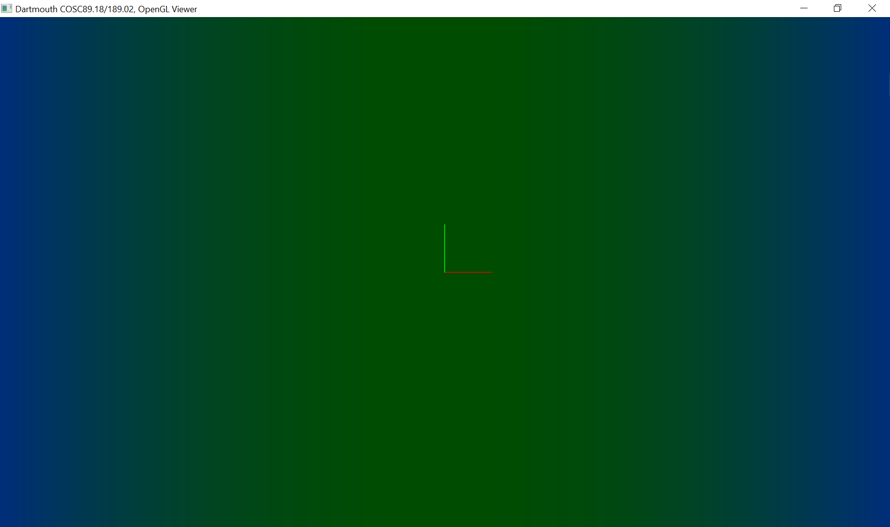

# COSC 89.18/189.02 Physical Computing Starter Code Manual

## 0. Quick Guide

If you are already experienced with using CMake to generate a C++ project, please read the following paragraphs for a quick guide. If not, you may read Section 1 and 2 first and then get back to check this section as a summary.

### Code Structure

The starter codebase is organized as `ext`, `src`, `proj`, and `viewer`. We put all external codes (e.g., the Eigen library) in `ext`. We put the common headers that can be shared among different subprojects in `src` (e.g., the classes of particles, mesh, grid, file IO, etc.). The folder `proj` maintains a number of subprojects we will use for demo or assignments. A subproject is dependent on `src` and `ext`, but is independent from any other subproject in `proj`.

Usually, you are asked to write code in one or multiple files in a subproject (e.g., in `proj/a0_hello_world` or in `proj/a1_mass_spring`). You don’t need to change files in ext or src (If you do, make sure to submit them for your assignment and let us know to avoid any compiling issue).

### OpenGL Viewer

The folder viewer maintains the code for the OpenGL viewer that is used to visualize your simulation data. You may think of the viewer as a subproject, which is independent from other subprojects. The difference is, the viewer has its own external dependencies, including `freeglut`, `glm`, and `imgui`, which are all put in `viewer/ext`. The viewer also has its own common headers and source files in `viewer/src/`.

We provide viewer executables for different platforms. But you can also modify and compile the source code to generate your own customized viewer.

### Build and Compile

We use CMake to separate the source code and the build files. `CMakeLists.txt` is maintained in each subproject. To generate build files (e.g., an .sln file for Windows or a makefile for Linux), you need to 1) create a `build` folder to hold all subprojects; 2) create a subfolder under build for a specific subproject (e.g., `build/a0_hello_world`); and 3) use CMake to generate the build files (e.g., in `build/a0_hello_world`) based on the source code (e.g., in `proj/a0_hello_world`).

### Executable

The executables are generated in the Release or Debug folder under the subdirectory (e.g., `build/a0_hello_world/Release`).

The simulation data is generated in the same folder as the executable. Typically, we specify the argument –o for the folder name of each simulation (e.g., `build/a0_hello_world/Release/output`).

## 1. Compile and run the helloworld project:

### Step 1: Clone the source code from GitLab and enter the codebase folder

    git clone https://gitlab.com/boolzhu/dartmouth-phys-comp-starter
    cd dartmouth-phys-comp-starter

### Step 2: Build the project using CMake:

**Substep 2.0: Install CMake**

- **Windows**: Visit https://cmake.org/download/ and download the latest version.
- **Linux**: `sudo apt-get install cmake`
- **OSX**: `brew install cmake` (using [Homebrew](https://brew.sh/))

**Substep 2.1: Run setup.sh/bat**

    .\scripts\setup.bat [Windows]
    ./scripts/setup.sh [Linux/Mac]

### Step 3: Compile and run the code

To test if everything works correctly you can run:

    .\scripts\run_assignment.bat a0_hello_world [Windows]
    ./scripts/run_assignment.sh a0_hello_world [Linux/Mac]

This will:

- Compile the code for the hello world project and any dependencies
- Run the assignment and generate simulation data
- Open the viewer load the data that was just generated
	- In the viewer you can press `w` to start recording and `p` to play back the animation
- If you recorded anything and ffmpeg is installed, it will render a video of the simulation once the viewer is closed. This is saved under "assignment name".mp4

### Step 4: Start implementing!

- **Windows**: Open the .sln project file in the `build` folder.
- **Linux or OSX**: Use your editor of choice to edit the assignment files in `proj`

## 2. Compile and run the OpenGL viewer project

We provide executables for the OpenGL viewer in the repository. You may download and use them directly to visualize your simulation data.

You may also want to compile the source code if you are interested in customizing your own viewer. To do so, you may follow the same steps as you make and compile the hello_world project. The only difference is: the CMake source code path for the viewer is `[Your path]/dartmouth-phys-comp-starter/viewer/viewer` and the build path is `[Your path]/dartmouth-phys-comp-starter/build/viewer`

Once the viewer is compiled successfully, you will find the executable under the folder of `build/viewer/Release`. Run it in the command line (by default it will only open up an OpenGL window without reading any data), you will see a window like this:

To use the viewer to visualize your own data, you can simply specify the program argument -o to read your own output folder. We provided 50 frames of cloth simulation data in `viewer\test_data` for you to test the viewer. In the command line, go to the directory of the viewer executable and type `opengl_viewer.exe -o [your path]/dartmouth-phys-comp-starter/viewer/test_datatest_data` and you will see a triangle mesh for cloth.

There are four shortcuts in the viewer so far:
- `p`, play/stop the frames;
- `r`, return to the first frame;
- `]`, go to the next frame;
- `[`, go to the previous frame.

