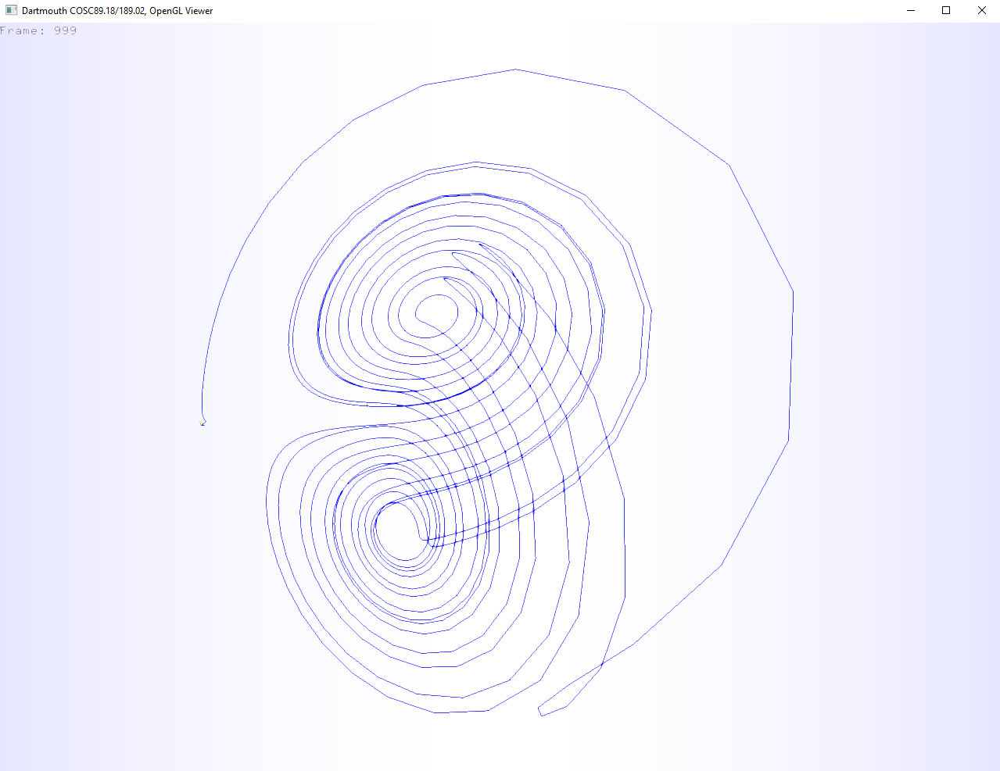

# COSC 89.18/189.02 Physical Computing Starter Code Manual

## 0. Quick Guide

If you are already experienced with using CMake to generate a C++ project, please read the following paragraphs for a quick guide. If not, you may read Section 1 and 2 first and then get back to check this section as a summary.

### Code Structure

The starter codebase is organized as `ext`, `src`, `proj`, and `viewer`. We put all external codes (e.g., the Eigen library) in `ext`. We put the common headers that can be shared among different subprojects in `src` (e.g., the classes of particles, mesh, grid, file IO, etc.). The folder `proj` maintains a number of subprojects we will use for demo or assignments. A subproject is dependent on `src` and `ext`, but is independent from any other subproject in `proj`.

Usually, you are asked to write code in one or multiple files in a subproject (e.g., in `proj/a0_dynamic_system` or in `proj/a1_mass_spring`). You don’t need to change files in ext or src (If you do, make sure to submit them for your assignment and let us know to avoid any compiling issue).

### OpenGL Viewer

The folder viewer maintains the code for the OpenGL viewer that is used to visualize your simulation data. You may think of the viewer as a subproject, which is independent from other subprojects. The difference is, the viewer has its own external dependencies, including `freeglut`, `glm`, and `imgui`, which are all put in `viewer/ext`. The viewer also has its own common headers and source files in `viewer/src/`.

### Build and Compile

We use CMake to separate the source code and the build files. `CMakeLists.txt` is maintained in each subproject. To generate build files (e.g., an .sln file for Windows or a makefile for Linux), you need to 1) create a `build` folder to hold all subprojects; 2) create a subfolder under build for a specific subproject (e.g., `build/a0_dynamic_system`); and 3) use CMake to generate the build files (e.g., in `build/a0_dynamic_system`) based on the source code (e.g., in `proj/a0_dynamic_system`).

### Executable

The executables are generated in the Release or Debug folder under the subdirectory (e.g., `build/a0_dynamic_system/Release`).

## 1. Compile and run the dynamic_system project:

### Step 1: Clone the source code from GitLab and enter the codebase folder

    git clone https://gitlab.com/boolzhu/dartmouth-phys-comp-starter
    cd dartmouth-phys-comp-starter

### Step 2: Build the project using CMake:

**Substep 2.0: Install CMake**

- **Windows**: Visit https://cmake.org/download/ and download the latest version.
- **Linux**: `sudo apt-get install cmake`
- **OSX**: `brew install cmake` (using [Homebrew](https://brew.sh/))

**Substep 2.1: Install Dependencies (Linux/OSX only)**
- **Linux**: `sudo apt-get install glew freeglut`
- **OSX**: `brew install glew freeglut`

**Substep 2.2: Run setup.sh/bat**

    .\scripts\setup.bat [Windows] (Attention: This is for those who use Visual Studio 2017. If you are using VS 2019, please change the 3rd line of setup.bat to "cmake -G "Visual Studio 16 2019" ..")
    ./scripts/setup.sh [Linux/OSX]

### Step 3: Compile and run the code

To test if everything works correctly you can run:

    .\scripts\run_assignment.bat a0_dynamic_system 1 [Windows]
    ./scripts/run_assignment.sh a0_dynamic_system 1 [Linux/Mac]

This will:

- Compile the code for the a0_dynamic_system project and any dependencies
- Run the assignment and visualize the real-time simulation in the OpenGL window (press 'p' to start/stop simulation)

### Step 4: Start implementing!

- **Windows**: Open the .sln project file in the `build` folder.
- **Linux or OSX**: Use your editor of choice to edit the assignment files in `proj`

## 3. Command Line Details

While the `setup` and `run_assignment` scripts should get you up and running quickly, you might want to peek behind the curtains and run the individual parts manually.

You should familiarize yourself with CMake, which is a tool that allows you to describe your build steps in a platform independent way.

### Setup

During setup, the script creates a directory called `build` in your top level project folder. 
This is standard CMake practice and makes sure that we are not polluting our source code with platform specific build files.

The script enters the directory and executes CMake using `cmake ..`. CMake finds the `CMakeLists.txt' file in the project folder and executes the build setup steps that we configured.

After this runs, you will have a bunch of files and folders in the `build` folder. You might notice that the folder structure mirrors the one in the source folder.

You can find the project build files related to "proj/assignment" in "**build**/proj/assignment". Following this pattern, the project build files related to the viewer are in "**build**/viewer/viewer".

### Build

The build step can be done through cmake as well. In the `build` folder, run 

    cmake --build . --config Release
    
This will build the viewer as well as all assignments and examples.

You'll find the assignment executables in their respective subfolders in the `build` folder. If you want to run an assignment (e.g., assignment 1) and look at the result the process is the following

    ./proj/a1_mass_spring/a1_mass_spring -test "the number of the test you want to run"
    
For more details, you can look at the `setup` and `run_assignment` scripts!
